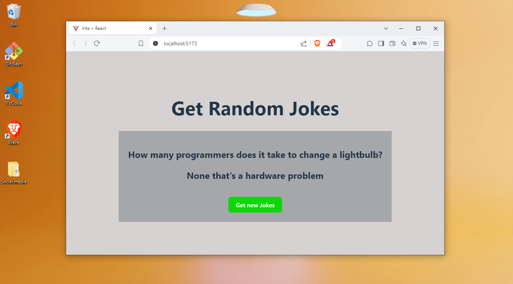
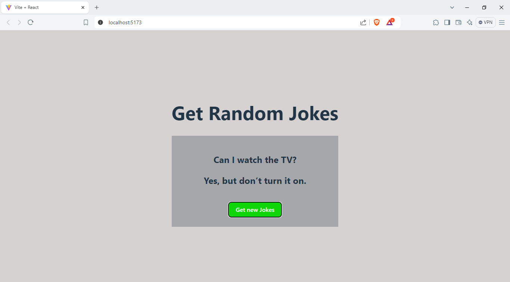

# Jokes API to fetch random joke
Uses the jokes api and fetch the random jokes.  
Note: `Find all links and plugins at the bottom`.

# Here's the output

# Steps to run the program 
 - Make sure you have node installed. 
 - Make sure you have React+Vite installed.
 - Finally open terminal and run `npm run dev` and open the link.

# Feel free to fork and make changes 
You can fork and make any changes and send it to me if it's worth I'll definately accept your Pull Request.

# Installation prerequisites
Make sure to install the below libraries and environment before you run the program 
Follow the steps below to intall dependencies.

# Install Node 
 https://nodejs.org/en

# Install React + Vite

This template provides a minimal setup to get React working in Vite with HMR and some ESLint rules.

Currently, two official plugins are available:

- [@vitejs/plugin-react]
(https://github.com/vitejs/vite-plugin-react/blob/main/packages/plugin-react/README.md)
uses [Babel](https://babeljs.io/) for Fast Refresh

- [@vitejs/plugin-react-swc]
(https://github.com/vitejs/vite-plugin-react-swc) 
uses [SWC](https://swc.rs/) for Fast Refresh
